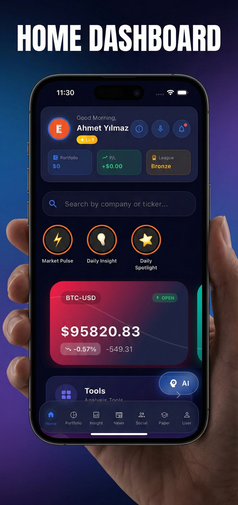

<!-- Header Section -->
<h1 align="center">✨ Hi, I'm Emir TUNALI</h1>
<h3 align="center">Software Developer | AI & FinTech Builder | Clean Architecture Enthusiast</h3>

  

---

## 👨‍💻 About Me

I'm **Emir Tunalı**, a software developer from Istanbul 🇹🇷  

🎓 Istanbul Ticaret University — **1st in Faculty (GPA: 3.54/4.00)**  
🧠 Passionate about **AI systems, scalable backend architecture, and financial technologies**  
⚙️ I design and build production-ready applications from backend to mobile deployment.  
🚀 Strong believer in clean code, system design, and continuous learning.

---

## 🧰 Tech Stack

  

---

# 🚀 Featured Project

## 📊 FinSight Pro Simulation  
**AI-Powered Market Analysis & Paper Trading App**

Cross-platform financial intelligence application built with **Flutter (iOS & Android)** and a **FastAPI (Python)** backend.

🔗 App Store:  
https://apps.apple.com/tr/app/finsight-pro-simulation/id6757315007?l=tr  

> Educational simulation platform — no real-money trading involved.

### Key Highlights
- Hybrid AI engine (ML + LLM integrations)
- Real-time WebSocket market data
- Portfolio risk & diversification analytics
- AI-driven market insights & sentiment analysis
- Automated analytical report generation (PDF)

### Tech Stack
Flutter • FastAPI • PostgreSQL • WebSocket • Firebase  
scikit-learn • OpenAI API • Gemini • Render
### 📸 App Preview

  

---

# 💬 Other Projects

### 💬 Android Chat App  
Real-time messaging application with Firebase authentication  
**Tech:** Java, Firebase  

### 🖥️ Windows Chat App  
Secure client-server communication system  
**Tech:** C#, .NET  

### 🧠 Android Quiz App  
Interactive quiz application with timer & scoring  
**Tech:** Java  

### 🌐 Logistics Website  
Responsive corporate website  
**Tech:** HTML, CSS, JavaScript  

---

# 🧪 Experience

### Software Testing Intern – EGEMSOFT / Türk Telekom  
- Performance testing with JMeter  
- Oracle database testing  
- Identified critical deployment issues  
- Data mining demo with Python  

### Software Intern – Kazancı Holding  
- Multi-layer .NET architecture  
- MS SQL Server integration  
- Docker deployment  

---

# 📊 GitHub Stats

  
  

---

# 📫 Connect With Me

  
  

---

### ⚡ Fun Fact
I enjoy building AI-powered systems, exploring system design patterns, and turning complex ideas into scalable applications.
